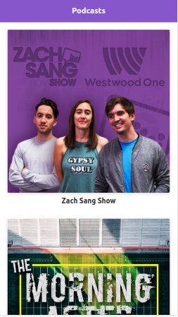

# Curso NextJS ("platzi-podcasts")

<https://hello-next-js-indol.vercel.app/>

<https://nextjs.org/docs/getting-started >

Next.js es un framework para construir aplicaciones web modernas en React. Una de sus principales características es que es pensado para tener una excelente experiencia como desarrollador; pero una característica más poderosa es generar un buen SSR para el cliente y manejar el SEO mucho más optimizado, los buscadores nos podrán encontrar más rápido y Google nos indexará muchísimo mejor gracias al SSR agregado.




# Iniciando

```
npm add next react react-dom
```

## Scripts

- next inicia la aplicación en modo desarrollo
- next build construye los archivos para producción
- next start uso los archivos del build para iniciar la aplicación en modo producción

# Styled JSX

El sistema de estilos de NextJS viene a resolver algunos problemas que son muy típicos del mundo de React, e incluso algunos que son más propios de CSS sobre todo relacionados a la escalabilidad.

```
<style jsx>{`.class {color: red;}`} </style>
```

OJO! Estos estilos solo aplican al componente en donde los estamos definiendo. Pero tambien hay manera de definir estilos globales mas alla de los componentes

```
<style jsx global>{`.class {color: red;}`} </style>

<style jsx>{`
  :global(p) {color: green}
`}<style>
```

# Recursos Estaticos

<https://nextjs.org/docs/basic-features/static-file-serving>
Para trabajar con recursos estaticos en NextJS solo los debemos incluir dentro de la carpeta _/public_ en la raiz del proyecto

```
function MyImage() {
  return 
}

export default MyImage
```

# Server Side Rendering

(First Load Rendering y Time To Interactive)

Una de las features mas importantes de next que mejora performance, SEO (indexa) y la UX.

Con el Client Side Rendering el server manda un HTML vacío, y tenemos que descargar toda la aplicación (JS) y esperar que haga lo suyo para poder empezar a ver el contenido


Con el Server Side Rendering, el servidor ya envía una HTML con CSS listo para que nuestra app se vea y se vea bien, por ende, el usuario tiene que esperar mucho menos para tener una primera vista de la aplicación.


Next.JS usa una mezcla de los dos: SSR para la carga inicial (por ser más rápido), y CSR cada vez que clickeamos en un link con la app inicializada, ya que ahí puede aplicar varias optimizaciones y mecanismos de precarga que hacen que todo funcione lo más rápido posible.

# Data fetching

<https://nextjs.org/docs/api-reference/data-fetching/getInitialProps>
<https://nextjs.org/docs/basic-features/data-fetching#getserversideprops-server-side-rendering>
-getStaticProps (Static Generation): Fetch data at build time.
-getStaticPaths (Static Generation): Specify dynamic routes to pre-render based on data.
-getServerSideProps (Server-side Rendering): Fetch data on each request.
-getInitialProps (deprecated)

La principal diferencia entre ambas funciones es que getServerSideProps() se llama en cada carga de página, mientras que getStaticProps() solo es llamada al momento de hacer build.

# LINK (componente)

<https://nextjs.org/docs/api-reference/next/link>

Siempre deben contener un _a_ u otro elemento hijo para linkear. No funciona como link de react router el cual "detras de escena" era un elemento _a_ encubierto

Si clickeamos en alguno de estos links la operacion ejecutada es del tipo _client side rendering_ esa nueva pagina solo va a cargar lo que haga falta y cambiar la ruta del browser ( solo ese js) pintar la pantalla con los nuevos datos. Esto se traduce en mayor performance.

PERO! si abrimos un link en un nuevo tab! se ejecutara server side rendering.

# PREFETCH

<https://nextjs.org/blog/next-9#prefetching-in-viewport-links> (only for production)

# PARAMETROS URL

<https://nextjs.org/docs/api-reference/next/link>

# HEAD (componente)

<https://nextjs.org/docs/api-reference/next/head>

# ERROR

<https://nextjs.org/docs/advanced-features/custom-error-page#404-page>

# Custom Document

<https://nextjs.org/docs/advanced-features/custom-document>

Para implementar ciertas librerias podriamos necesitar agregar informacion al Document, esto para casos muy particulares como por ejemplo implementar:

- google AMP
- Facebook instant pages
- Plugins como styled components

# Diseño URLs

Hay un par de principios que debemos considerar a la hora de diseñar nuestras url:

- _Legibilidad_: Deben ser fácilmente entendibles para los usuarios. Un usuario deberia poder ver una URL y inmediatamente entenderla.
  - //Esto no es legible
    - /channel?id=156486
  - //Esto si
    - /myFavoriteChannel
- _Consistencia_: Deberíamos poder borrar cualquier fragmento y la URL deberia continuar funcionando.
  - /myFavoriteChannel/my-live-audio
  - /myFavoriteChannel
  - /

# Rutas dinamicas

<https://nextjs.org/learn/basics/dynamic-routes>

# Vistas Hibridas

...

## Licencia 📄

MIT

## Conceptos Aprendidos 🤓

- <https://platzi.com/courses/nextjs/>

## Certificado

- [Diploma](./readme-static/diploma-next-2018.pdf)

---

👩‍💻 with ❤️ by [silnose](https://github.com/silnose) 😊
